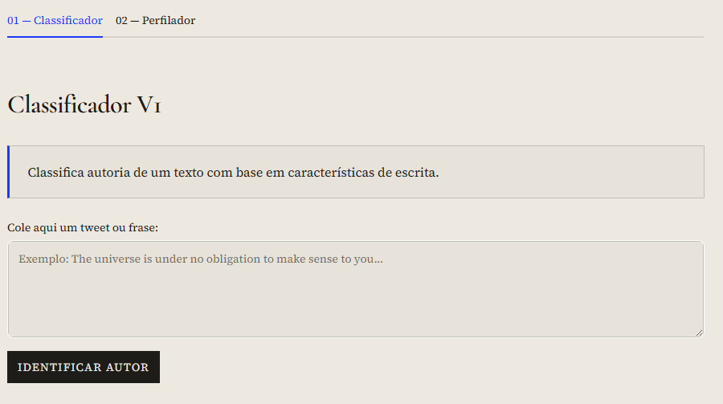
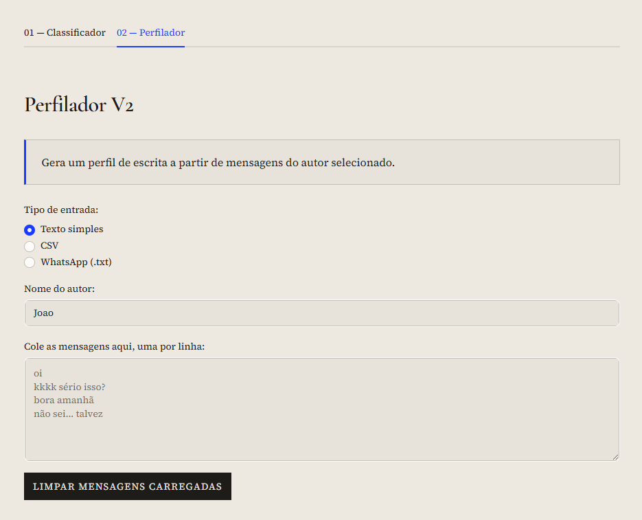

<div align="center">


# AssinaturaDigital

**Estilometria digital com Machine Learning clássico aplicada a textos curtos**


</div>

---

## Resumo

AssinaturaDigital é um projeto acadêmico de Machine Learning que investiga a viabilidade de identificar autoria de textos digitais curtos — como tweets e mensagens de chat — por meio de características estilométricas quantitativas. O sistema é composto por dois módulos independentes: um **classificador de autoria** (V1) treinado sobre um corpus público de tweets, e um **perfilador estilométrico** (V2) que analisa mensagens de um autor e gera um perfil descritivo de seu estilo de escrita.

---

## Problema investigado

Texto escrito carrega marcas inconscientes do seu autor: comprimento médio de palavras, proporção de letras maiúsculas, uso de emojis, padrões de risada (`kkk`, `rs`, `haha`), pontuação repetida, abreviações características. Essas marcas — chamadas de **features estilométricas** — são suficientemente estáveis para permitir, em contextos controlados, a distinção estatística entre autores.

O problema prático investigado aqui é: **dado um texto curto não identificado, é possível prever qual autor, dentre um conjunto conhecido, mais provavelmente o escreveu?** E, de forma complementar: **dado um conjunto de mensagens de um autor, é possível construir automaticamente um perfil quantitativo do seu estilo?**

Ambas as perguntas são respondidas com técnicas de ML clássico, sem modelos de linguagem ou embeddings neurais.

---

## Objetivos

- Extrair features estilométricas numéricas e textuais de textos digitais curtos
- Treinar e comparar modelos de classificação multiclasse de autoria
- Serializar o melhor pipeline para inferência em tempo real
- Construir perfis de escrita agregados por autor a partir de múltiplos formatos de entrada
- Oferecer uma interface de uso acessível via Streamlit

---

## Demonstração da interface

### Classificador V1 — Identificação de autoria



### Perfilador V2 — Análise estilométrica



---

## Fluxo geral do sistema

```
Texto de entrada
       │
       ├──── V1: Classificador ─────────────────────────────────────────────┐
       │         │                                                           │
       │         ├── Features manuais (12 métricas)                         │
       │         │   └── StandardScaler                                     │
       │         │                                                           │
       │         ├── TF-IDF de caracteres (n-grams 3–5, 6000 features)     │
       │         │                                                           │
       │         └── FeatureUnion → LinearSVC → Autor previsto              │
       │                                                                     │
       └──── V2: Perfilador ──────────────────────────────────────────────-─┘
                 │
                 ├── Loader (texto simples / CSV / WhatsApp .txt)
                 │
                 ├── Extração de features estilométricas por mensagem
                 │
                 └── Aggregation → Perfil do autor
                     (top words, bigrams, abreviações, padrões de risada,
                      médias de comprimento, pontuação, emojis, etc.)
```

---

## V1 — Classificador de autoria

O classificador recebe um texto livre e retorna o autor mais provável dentre os autores presentes no corpus de treinamento.

### Pipeline

O pipeline é construído com `sklearn.pipeline.Pipeline` e `FeatureUnion`, combinando dois blocos de features em paralelo:

**1. Features manuais** (`src/features_v1.py` + `src/models/v1_text_pipeline.py`)

| Feature | Descrição |
|---|---|
| `avg_word_length` | Comprimento médio das palavras |
| `num_words` | Total de palavras |
| `num_unique_words` | Palavras únicas |
| `unique_ratio` | Razão vocabulário único / total |
| `num_chars` | Total de caracteres |
| `num_punctuation` | Contagem de pontuação |
| `num_uppercase` | Total de letras maiúsculas |
| `num_emojis` | Contagem de emojis |
| `num_hashtags` | Ocorrências de hashtags |
| `num_mentions` | Ocorrências de menções |
| `num_exclamation` | Pontos de exclamação |
| `num_question` | Pontos de interrogação |

As features manuais são normalizadas com `StandardScaler(with_mean=False)` antes de serem combinadas com o TF-IDF.

**2. TF-IDF de caracteres** (`src/models/v1_text_pipeline.py`)

```python
TfidfVectorizer(
    analyzer="char",
    ngram_range=(3, 5),
    min_df=2,
    max_features=6000,
    lowercase=True,
)
```

> **Por que TF-IDF de caracteres?** N-grams de caracteres capturam padrões de digitação que resistem a variações lexicais: abreviações (`vc`, `pq`, `hj`), risadas com grafia variável (`kkk`, `kkkk`), contrações informais e pontuação repetida. Esses padrões são menos influenciados pelo *conteúdo* do que pela *forma* de escrever, tornando-os features estilométricas mais robustas do que n-grams de palavras.

**Classificadores avaliados:** Logistic Regression, LinearSVC (Linear SVM), Complement Naive Bayes.

O pipeline completo do melhor modelo é serializado em `models/v1_pipeline.pkl`.

---

## V2 — Perfilador estilométrico

O perfilador recebe mensagens de um autor e constrói um perfil descritivo do seu estilo de escrita. Diferente do classificador, ele não prevê autoria — ele **descreve** padrões.

### Formatos de entrada suportados

| Formato | Loader |
|---|---|
| Texto simples (uma mensagem por linha) | `src/loaders/generic_text_loader.py` |
| CSV com colunas `author` e `text` | `src/loaders/csv_loader.py` |
| Exportação do WhatsApp (.txt) | `src/loaders/whatsapp_loader.py` |

### Features extraídas por mensagem (`src/stylometry/feature_extractor.py`)

Além das 12 features do V1, o extrator da V2 inclui:

| Feature | Descrição |
|---|---|
| `uppercase_ratio` | Proporção de letras maiúsculas sobre total de letras |
| `punctuation_ratio` | Pontuação relativa ao total de caracteres |
| `emoji_ratio` | Emojis por palavra |
| `num_laughter_kkk` | Ocorrências de `kkk` (3+ k's) |
| `num_laughter_haha` | Ocorrências de `haha` |
| `num_laughter_rsrs` | Ocorrências de `rsrs` |
| `num_laughter_hehe` | Ocorrências de `hehe` |
| `total_laughter` | Soma de todos os padrões de risada |

### O que o perfil agrega (`src/stylometry/profile_builder.py`)

- Médias de comprimento, vocabulário, pontuação, emojis e risadas por mensagem
- Top 10 palavras mais frequentes (com remoção de stopwords PT/EN e termos ruidosos)
- Top 10 bigramas mais frequentes
- Abreviações detectadas (`vc`, `pq`, `tbm`, `hj`, `pra`, etc.)
- Padrões de risada predominantes
- Amostras representativas de mensagens (curta, média, longa)

> **Importante:** a V2 é experimental. O perfil gerado reflete padrões estatísticos presentes nas mensagens fornecidas. A recriação de estilo é baseada em regras simples derivadas do perfil — não é uma simulação fiel de uma pessoa real e não deve ser tratada como tal.

---

## Dataset

| Atributo | Valor |
|---|---|
| Arquivo | `data/tweet.csv` |
| Colunas utilizadas | `Name` (autor) e `Tweet description` (texto) |
| Divisão treino/teste | 75% / 25% estratificado por autor |
| Exemplos de treino | 14.010 |
| Exemplos de teste | 4.670 |
| Remoção de nulos | Linhas com `Name` ou `Tweet description` ausentes são descartadas |

O arquivo `data/teste_v2.csv` é usado exclusivamente para validação do pipeline V2 e não compõe o treinamento do classificador.

---

## Modelos avaliados e resultados

Três modelos foram treinados sobre o mesmo pipeline de features e avaliados no conjunto de teste:

| Modelo | Accuracy | Precision (macro) | Recall (macro) | **F1 (macro)** |
|---|---|---|---|---|
| **Linear SVM** | **0.8469** | **0.8461** | **0.8447** | **0.8451** |
| Logistic Regression | 0.8321 | 0.8322 | 0.8291 | 0.8298 |
| Complement Naive Bayes | 0.7563 | 0.7609 | 0.7509 | 0.7528 |

> **Por que F1 macro?** Em problemas de classificação multiclasse com distribuição potencialmente desbalanceada entre autores, a accuracy pode mascarar baixo desempenho em classes minoritárias. O F1 macro calcula o F1 individualmente para cada classe e os média sem ponderação, punindo modelos que ignoram autores com poucas amostras. É a métrica mais informativa para avaliar a qualidade real do classificador neste contexto.

O Linear SVM obteve o melhor F1 macro e foi selecionado como modelo final. Os artefatos do modelo estão em `models/`.

---

## Instalação

```powershell
# 1. Clonar o repositório
git clone https://github.com/JoaoMiltzarek/Assinaturadigital.git
cd Assinaturadigital

# 2. Criar e ativar o ambiente virtual
python -m venv venv
.\venv\Scripts\Activate.ps1

# 3. Instalar dependências
python -m pip install -r requirements.txt
```

**Dependências principais:**

```
streamlit
pandas
numpy
scikit-learn==1.8.0
joblib
emoji
matplotlib
seaborn
wordcloud
```

---

## Como executar a interface

```powershell
python -m streamlit run app.py
```

A interface abre no navegador padrão em `http://localhost:8501` com duas abas:

- **01 — Classificador:** cole um texto e clique em "Identificar Autor"
- **02 — Perfilador:** carregue mensagens por texto simples, CSV ou exportação WhatsApp e gere o perfil estilométrico

---

## Como treinar o modelo

O script de treinamento treina os três modelos candidatos, seleciona o melhor por F1 macro e salva o pipeline, as métricas e a matriz de confusão.

```powershell
python scripts\train_v1_pipeline.py
```

Artefatos gerados em `models/`:

| Arquivo | Conteúdo |
|---|---|
| `v1_pipeline.pkl` | Pipeline serializado (melhor modelo) |
| `v1_metrics.csv` | Métricas completas dos três modelos |
| `v1_confusion_matrix.csv` | Matriz de confusão do melhor modelo |
| `v1_model_summary.txt` | Resumo textual do treinamento |

---

## Como validar

```powershell
# Verificar sintaxe do app principal
python -m py_compile app.py

# Validar o pipeline V1 (carregamento e inferência)
python scripts\validate_v1_pipeline.py

# Validar o pipeline V2 (extração de features e perfil)
python scripts\validate_v2_pipeline.py

# Validar com dados de amostra CSV
python scripts\validate_v2_sample_data.py

# Validar casos extremos do parser WhatsApp
python scripts\validate_whatsapp_edge_cases.py
```

---

## Estrutura de pastas

```
AssinaturaDigital/
├── app.py                          # Interface Streamlit principal
├── requirements.txt
├── data/
│   ├── tweet.csv                   # Dataset principal (tweets)
│   └── teste_v2.csv                # Dados de validação V2
├── docs/
│   ├── logo.png
│   ├── screenshot_classificador.png
│   └── screenshot_perfilador.png
├── models/
│   ├── v1_pipeline.pkl             # Pipeline serializado (Linear SVM)
│   ├── v1_metrics.csv              # Métricas dos modelos avaliados
│   ├── v1_confusion_matrix.csv     # Matriz de confusão
│   └── v1_model_summary.txt        # Resumo textual do treinamento
├── scripts/
│   ├── train_v1_pipeline.py        # Treina e salva o pipeline V1
│   ├── validate_v1_pipeline.py     # Valida carregamento e inferência
│   ├── validate_v2_pipeline.py     # Valida pipeline V2
│   ├── validate_v2_sample_data.py  # Valida com CSV de amostra
│   └── validate_whatsapp_edge_cases.py
└── src/
    ├── features_v1.py              # Features manuais do classificador
    ├── loaders/
    │   ├── csv_loader.py
    │   ├── generic_text_loader.py
    │   └── whatsapp_loader.py      # Parser de exportação WhatsApp
    ├── models/
    │   ├── authorship_trainer.py   # Treinamento leve em memória (V2)
    │   └── v1_text_pipeline.py     # Construção do pipeline V1
    ├── processing/
    │   ├── cleaner.py
    │   └── normalizer.py
    └── stylometry/
        ├── feature_extractor.py    # Extração de features estilométricas
        ├── profile_builder.py      # Construção do perfil por autor
        └── style_replicator.py     # Recriação de estilo (experimental)
```

---

## Decisões técnicas

**FeatureUnion em vez de pipeline linear:** combinar features manuais e TF-IDF de caracteres em paralelo permite que o modelo explore dois espaços de representação complementares: métricas numéricas de alto nível (quantas exclamações, qual o comprimento médio) e padrões sub-lexicais de baixo nível (n-grams de caracteres). A separação em dois ramos mantém o código testável e facilita a adição de novos blocos de features.

**LinearSVC em vez de SVM kernelizado:** para datasets com número de features alto (12 manuais + até 6000 TF-IDF), o LinearSVC é significativamente mais rápido e escala bem, sem custo adicional de kernel. A separação linear no espaço TF-IDF de alta dimensão é geralmente suficiente para tarefas de classificação de texto.

**ComplementNB como baseline:** o Complement Naive Bayes é tipicamente superior ao Multinomial NB em datasets desbalanceados. Foi incluído como baseline interpretável e de custo computacional baixo.

**Parser WhatsApp robusto:** o `whatsapp_loader.py` lida com múltiplos formatos de data/hora de exportação (12h/24h, separadores variados), mensagens multilinhas e filtragem de mensagens de sistema, sem depender de expressões regulares frágeis.

**Treinamento em memória (V2):** o `authorship_trainer.py` treina modelos sob demanda na própria sessão do Streamlit, sem persistência em disco. Isso permite ao usuário carregar suas próprias mensagens e obter resultados imediatos sem configuração prévia.

---

## Limitações

- **Textos muito curtos** comprometem a confiabilidade da classificação. Features estilométricas são estatisticamente instáveis quando calculadas sobre poucas palavras.
- **Autores estilisticamente parecidos** tendem a ser confundidos. O modelo não tem mecanismo de rejeição — sempre retorna um autor, mesmo com baixa confiança.
- **Viés de dataset:** o corpus de tweets favorece autores com muitas amostras. Autores sub-representados têm desempenho menor, o que é capturado pelo F1 macro mas não pela accuracy.
- **Domínio fechado:** o classificador só consegue prever autores presentes no treinamento. Textos de autores desconhecidos serão sempre atribuídos incorretamente ao autor mais parecido.
- **Baixa generalização fora do contexto treinado:** o modelo foi treinado em tweets. Desempenho em outros domínios (e-mails, redações formais) não foi avaliado.
- **V2 experimental:** o perfil gerado é descritivo, não preditivo. A recriação de estilo é baseada em substituições por regras simples e não representa fielmente a escrita de nenhuma pessoa real.

---

## Considerações éticas

Este sistema foi desenvolvido exclusivamente para fins acadêmicos. **Não deve ser utilizado para identificação real de pessoas fora desse contexto.**

A atribuição automática de autoria a textos não identificados carrega riscos sérios: acusações infundadas, violação de privacidade e reforço de vieses presentes no corpus de treinamento. A estilometria computacional, mesmo com alta acurácia em condições controladas, não oferece garantias suficientes para uso em contextos legais, jornalísticos ou de segurança sem revisão especializada.

O uso responsável desta tecnologia exige transparência sobre suas limitações, supervisão humana nas decisões e consentimento das pessoas cujos textos são analisados.

---

## Próximas evoluções

- [ ] Calibração de probabilidade (`CalibratedClassifierCV`) para expor scores de confiança na inferência
- [ ] Suporte a múltiplos datasets de treinamento além de `tweet.csv`
- [ ] Avaliação com cross-validação estratificada (k-fold) em vez de split único
- [ ] Visualização da matriz de confusão interativa na interface
- [ ] Expansão do vocabulário de abreviações e padrões de risada no perfilador
- [ ] Exportação do perfil estilométrico em formato PDF ou JSON

---

## Autor e licença

Projeto desenvolvido por **João Miltzarek** como trabalho acadêmico de Machine Learning.

Licença MIT — veja [LICENSE](LICENSE) para detalhes.